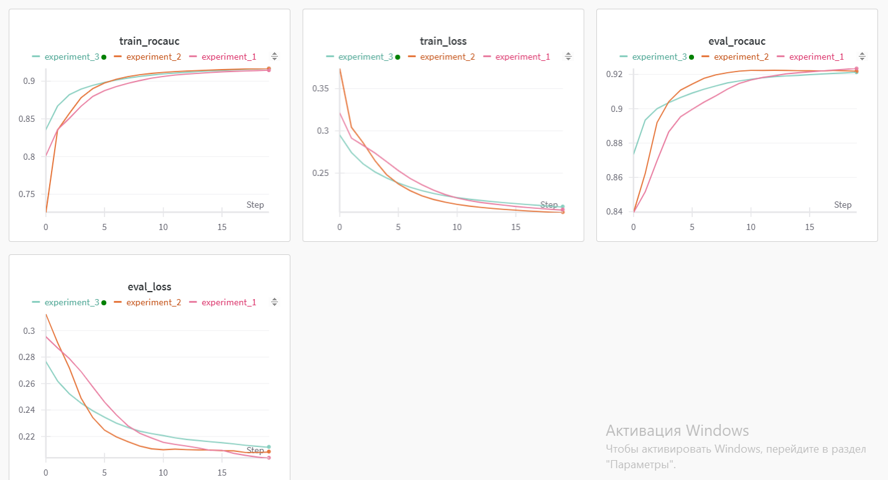

# Эксперимент 1

На протяжении 20 эпох метрики улучшаются, но ближе к 20 эпохам это улучшение замедляется, вероятно оптимальное количество будет примерно в районе 20-25 эпох. roc_auc на валидационной выборке примерно 0.923 / loss 0.2

# Эксперимент 2

По сравнению с предыдущей моделью метрики этой быстрее росли в начале, однако на 10 эпохе вышли на то же плато что и предыдущая модель на 20.
roc_auc 0.922 / loss 0.208

# Эксперимент 3

В начале модель обучалась лучше остальных, но по итогу те же результаты что и у остальных моделей. Возможно при большем количестве эпох разница была бы виднее.
roc_auc 0.921 / loss 0.2127

# Эксперимент 4

Проверялись вероятности 0.1, 0.2, 0.5, 0.01

Низкие p дали результат лучше остальных. В целом при всех p обучение идет одинаково, но при более больших вероятностях dropout метрики хуже. Лучший результат для p = 0.1
roc_auc 0.92 / loss 0.216

# Эксперимент 5

Для данной модели видно, что высокий learning_rate положительно сказывается на качестве, все модели с высоким lr имеют хорошие метрики, в то время как влияение weight_decay не совсем ясно.
roc_auc 0.9286 / loss 0.199

